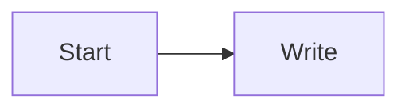

# Writing Guide

## 文章目录

文章放在：

```text
src/content/blog/
```

仓库里有一个草稿模板：

```text
src/content/blog/_template.mdx
```

写新文章时复制它，不要直接把模板改成正式文章。模板设置了 `draft: true`，不会发布成页面。

文件名会成为 URL slug：

```text
src/content/blog/my-first-post.mdx
=> /blog/my-first-post/
```

建议文件名只使用小写英文、数字和连字符。

## 图片目录

图片放在：

```text
public/images/blog/<article-slug>/
```

在 MDX 中引用：

```md

```

## Frontmatter

每篇文章必须包含：

```md
---
title: "文章标题"
date: "2026-06-07"
description: "一句话摘要，会显示在首页、归档和文章页头部。"
tags: []
draft: false
---
```

字段说明：

- `title`：文章标题。
- `date`：发布日期，使用 `YYYY-MM-DD`。
- `description`：文章摘要。
- `tags`：暂时保留字段，当前版本不做 tag 检索。
- `draft`：设为 `true` 时不发布。

## 正文写法

行内公式：

```md
$V^\pi(s)$
```

块级公式：

```md
$$
V^\pi(s)=\mathbb{E}_\pi \left[\sum_{t=0}^{\infty}\gamma^t r_t \mid s_0=s\right]
$$
```

代码块：

````md
```python
def hello():
    return "world"
```
````

Mermaid：

````md

````

## 发布步骤

1. 在 `src/content/blog/` 新建 `.mdx`。
2. 如有图片，在 `public/images/blog/<article-slug>/` 放图片。
3. 本地运行：

```bash
npm run validate
```

4. 提交并推送到 `main`：

```bash
git add .
git commit -m "Add new post"
git push origin main
```

5. GitHub Actions 会自动检查、构建、生成搜索索引并部署到 GitHub Pages。

## 站点信息和样式

站点标题、导航、首页标题和副标题集中在：

```text
src/site.config.ts
```

主题颜色、布局、正文、代码块和图片样式集中在：

```text
src/styles/global.css
```

新增页面时优先复用：

```text
src/layouts/BaseLayout.astro
src/layouts/ArticleLayout.astro
src/components/ArticleCard.astro
src/components/BlogSidebar.astro
```
